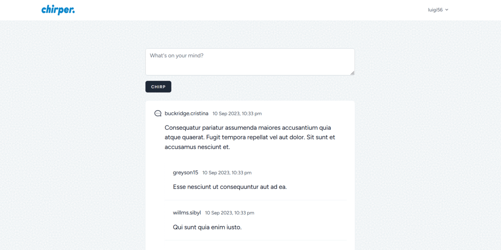

# Laravel Chirps bootcamp Tutorial Project

Learn Laravel Livewire 3 and Alpine.js with Chirps - A Practical Example from https://bootcamp.laravel.com 

- Create Chirps
- Edit Chirps
- Delete Chirps
- Comment on Chirps (Create & Delete)
- Load more on scroll using Alpine.js Intersect Plugin




## Quick Installation

1. **Clone the Repository:**
    - Clone this repository to your local machine using the following command:
      ```
      git clone https://github.com/olakunlevpn/laravel-bootcamp.git
      ```

2. **Install PHP Dependencies:**
    - Navigate to the project directory and run the following command to install PHP dependencies using Composer:
      ```
      composer install
      ```

3. **Install JavaScript Dependencies:**
    - After installing PHP dependencies, run the following command to install JavaScript dependencies using npm:
      ```
      npm install 
      npm run dev
      ```

4. **Generate Application Key:**
    - Rename env.example to .env Generate the Laravel application key by running the following command:
      ```
      php artisan key:generate
      ```

5. **Configure Database Connection:**
    - Open your `.env` file and set the `DB_CONNECTION` to `sqlite`:
      ```
      DB_CONNECTION=sqlite
      ```
6. **Configure your mail service:**
   - Configure Laravel to write mail to a log file by editing the .env file in your project and changing the MAIL_MAILER environment variable to log. By default, emails will be written to a log file located at storage/logs/laravel.log or you may utilize local email testing tools like Mailpit and HELO to catch any emails coming from your application so you may view them

    ```
    MAIL_MAILER=log
    ```


7. **Migrate and Seed Database:**
    - Run the following commands to migrate and seed the database:
      
    ```
      php artisan migrate
      php artisan db:seed
      ```

8. **Start the Development Server:**
    - Finally, start the Laravel development server by running the following command:
      ```
      php artisan serve
      ```

9. **Access the Application:**
    - You can now access the application in your web browser at [http://localhost:8000](http://localhost:8000).


10. **Further Guidance:**
    - For more detailed instructions and advanced configurations, please refer to the official Laravel documentation on Blade installation at [https://bootcamp.laravel.com/blade/installation](https://bootcamp.laravel.com/blade/installation).

